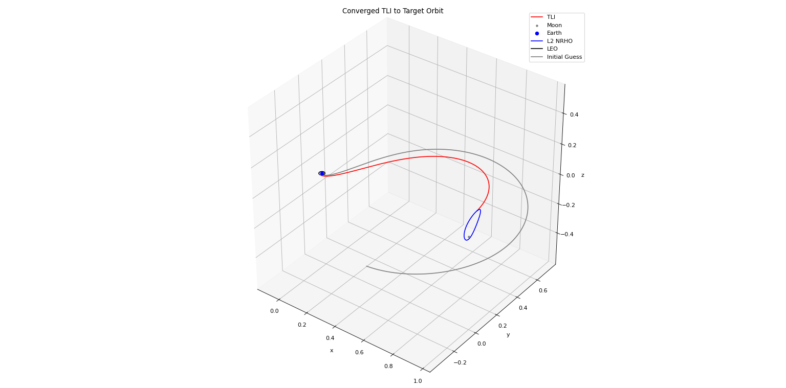
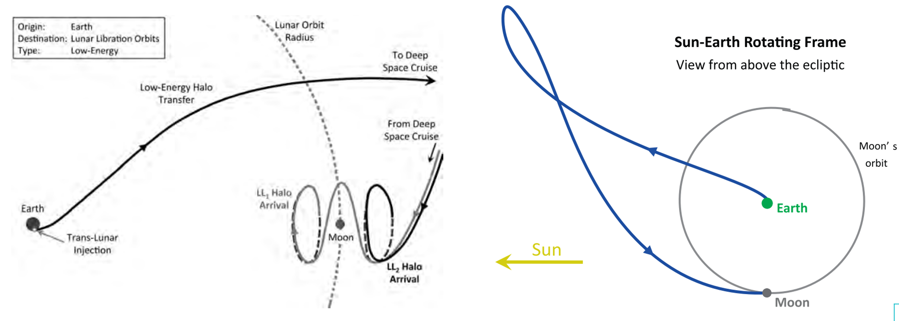

Hi! Welcome to my academic and professional portfolio website (as distinct from my non-academic website, link coming soon). This is a Medina Station of sorts to redirect or point you towards any of my non-fiction writing, publications, talks, or projects, and to serve as an academic and professional overview of me and my interests. 

I am currently a PhD Student at the University of New South Wales, based on their Canberra campus at the Australian Defence Force Academy (though I am not in the Defence Force), and I work part-time with Shoal Group as a Modelling & Simulation Engineer to support decision-making in Defence and Space. My research project revolves around spacecraft navigation, specifically in trajectory design, even more specifically in cislunar applications. How do we move in this region of space? How can we improve? What dynamics drive this motion? How do we design with failure and risk in mind? The Moon beckons, and we as a species have decided to return - I want to do my bit with the tools I have at my disposal to be a part of what will surely be the greatest undertaking of our generation. I hope. And if not, in the meantime, I get to learn about fascinating and beautiful maths and how the universe works. I mean, look at this: 

![Invariant Manifolds of the L1 libration point orbit [1]](../images/l1_libration_orbit_invariant_manifolds.png)
*Invariant Manifolds of the L1 libration point orbit [1]*

![3-body orbits around the Moon [2]](../images/3_body_orbits.jpg)
*3-body orbits around the Moon [2]*

![Members of the L1 quasi-halo family of orbits [3]](../images/l1_quasi_halo_family.png)
*Members of the L1 quasi-halo family of orbits [3]*

Just try and tell me things like this don't just draw you in and make you want to understand, to hear what music moves them. 

# PhD Project - Cislunar Robust Trajectory Optimisation Under Navigation Uncertainty and Thrust Execution Error
I've explored a number of ideas for my project, and I expect it will continue to evolve over the remainder of my study. As discussed above, they all centre around the concepts of trajectory design for cislunar applications. If my work touches on your research areas or you'd like to open a dialogue about it, I encourage you to get in touch via email (in the sidebar)!
## A risky region of space
Cislunar space represents a highly non-linear, chaotic, and uncertain area of space. At the time of writing, there are 38 public and private missions planned to the Moon, in addition to those already there. This is to become a very congested region, and the space will have to be shared. 

But unlike elliptical 2-body Keplerian orbits, when manoeuvres go wrong, either misfiring or not firing altogether, the dynamics of the region don't always permit a second attempt one period later. Periodic orbits are few and typically unstable, and most often transfers between them do not lie on repeating paths. Any failure to insert onto the nominal path typically means asymptotic departure from that path. Furthermore, our sensing equipment is not perfect, and uncertainties arise in the knowledge of our spacecraft state through the navigation process. How do we design or choose trajectories that account for this? What do we do when these failures occur? Is there some optimal trade-off between awaiting a better state estimate versus requiring correction manoeuvres earlier to enable cheap recovery? How can we optimise beyond simply examining the fuel cost of a particular trajectory - if we allow suboptimalities in that metric, what does it enable from an operational perspective (e.g. effect on timelines for navigators, senstivity of TCM to state uncertainty, etc)?

## Understanding the combination of these effects
When trajectory designers want to optimise for these uncertainties and errors, the exact state of the spacecraft - and the knowledge of that state - will not be known ahead of time, but the statistical distributions can be defined and propagated. We need to first combine these effects to produce a knowledge-constrained understanding of where we might end up following a manoeuvre with stochastic error. This combined distribution can now take the role of a metric against which the trajectory can be optimised. It tells us the probability that we will think we are in a particular state following a thrust perturbation from nominal when our knowledge is constrained by navigation effects. 

Ideally, this combination would be lightweight and simple to propagate - not an easy task. Cislunar space is chaotic, unstable, and most importantly, non-linear. These non-linearities have been examined before in the process of robust trajectory design and more often than not introduce massive computational penalties for optimisation algorithms: every new execution run of the optimisation loop has to recompute these complex non-linearities through particle filters (e.g. CUT, Monte Carlo, etc) or other highly expensive methods. So for our purposes, a computationally light, straightforward combination of these two effects is critical in producing fast optimisation of trajectories. Such a lightweight model will necessarily lack some of the nuance and fidelity of the full non-linear models, but if it allows us to skim over the solution space quickly and provides us with a first-pass estimate for optimal trajectories under these uncertainties, then mission designers can use this first-pass as an initial guess when introducing the non-linear effects. 

## Verifying and validating the model
Whatever model is produced in these efforts will need to be evaluated for validity. It serves no purpose to propose a simplified model that is so simplified it no longer represents the actual distribution of knowledge following a manoeuvre with error. Following the development of the analytical model above, a particle filter method will be employed to examine its efficacy in various regions of space and dynamic models (including both 2-body Keplerian dynamics and the CRTBP). The bounds of validity for the model will also be defined - state-dependent bounds will be necessary to enable this tool to be actually useful for future designs, rather than simply the test cases used in this step. 

As in every verification and validation step in engineering, there is the possibility of failure. The analytical model developed may not work. In this case, the plan is to utilise existing published models for robust trajectory analysis, such as unscented transforms for instance, and simply accept the increased computational effort while utilising GPU-acceleration to mitigate it somewhat in order to move to the next step. 

## Optimising transfers
Finally, we can use the model we have developed. As mentioned above, the goal is to examine other metrics than the traditional optimisation for fuel cost or time of flight. Operational concerns, such as time between execution error and required TCM execution, sentivity of the TCM value to the uncertainties in state introduced by knowledge and initial dispersion, the trade-off of executing at a different window that provides other benefits such as observability or safety, etc., all have an impact on what we may consider "optimal". Yes the fuel cost may be higher to choose a different set of metrics, but how does it effect the risk profile of the mission? How does multi-objective optimisation enter into the picture? After all, fuel cost is still a primary concern for mission designers and we shouldn't throw it out all together. 

Three cislunar transfer test cases will be used to illustrate the models utility and efficacy in optimising transfers: 
- a direct transfer from LEO to an NRHO:

*Example LEO to NRHO transfer, utilising constrained departure altitude, constrained end position, and constrained to an apse point at NRHO apolune*

- a semi-direct transfer, from LEO onto the stable manifold of an axial orbit:

*Stable manifold of an L1 Axial orbit*

- and a low-energy ballistic transfer to a Lyapunov orbit:

*Example low-energy ballistic transfer to Lyapunov orbit [4,5]*

These can be initially designed according to the traditional methodology - i.e. optimised for fuel costs - and from there, we can introduce a number of different potential optimisation metrics:
- Size of the TCM dispersion, $$\mathscr{E}$$, induced by the model developed - something like root square sum (RSS)
- Max time of execution of TCM, $$𝑡_𝑐$$, given limit to TCM $$\delta 𝑉$$ or RSS($$\mathscr{E}$$)
- Minimum total $$\Delta V_T=\Delta V_{nom} + \delta 𝑉_{TCM}$$, given limit to $$𝑡_𝑐$$

Any one of these can then be analysed further.

This methodology and thesis is not intended to provide an expression for the optimal terms - there a many thousands of transfers to the Moon and every one of them will have drastically different optimal properties. Instead, these three example cases are meant to illustrate the utility of the models developed and identify any interesting effects induced by optimising for metrics other than the traditional ones while accounting for resilience to stochastic errors and knowledge constraints. 

References
------
[1] Anderson, R. L., & Parker, J. S. (2012). Survey of ballistic transfers to the lunar surface. Journal of Guidance, Control, and Dynamics, 35(4), 1256–1267. https://doi.org/10.2514/1.54830

[2] Baker-McEvilly, B., Bhadauria, S., Canales, D., & Frueh, C. (2024). A comprehensive review on Cislunar expansion and space domain awareness. Progress in Aerospace Sciences, 147. https://doi.org/10.1016/j.paerosci.2024.101019

[3] Brian McCarthy, & Kathleen Howell. (2022). Accessing the Vicinity of the L1 Libration Point via Low-Energy Transfers Leveraging Quasi-Periodic Orbits. Astrodynamics Specialist Conference.

[4] Parker, J. S., & Anderson, R. L. (2014). Low-Energy Lunar Trajectory Design (Joseph H. Yuen, Ed.). John Wiley & Sons.

[5] Parker, J. S., & Anderson, R. L. (2013). Targeting low-energy transfers to low lunar orbit. Acta Astronautica, 84, 1–14. https://doi.org/10.1016/j.actaastro.2012.10.033

